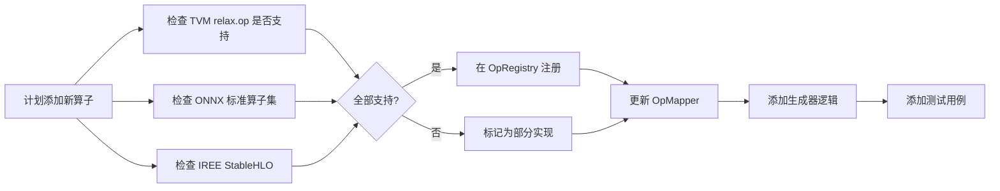

# AiFuzzer — 外部配置系统与 IR 扩展设计方案

> 版本: 0.2
> 日期: 2026-07-04
> 目标: 允许通过外部配置文件控制运行行为；扩展 IR 内容和生成/翻译能力，同时保留多编译器兼容接口

---

## 1. 外部配置系统设计

### 1.1 设计目标

- 支持通过 **YAML/JSON/TOML** 文件指定 fuzzing 运行参数
- 配置文件定义：生成器行为、启用的后端、算子白名单/黑名单、输出目录等
- 命令行可覆盖配置文件的特定参数
- 支持多 profile（如 `debug`, `full`, `quick-test` 等）
- 无配置文件时使用代码内的默认值（向后兼容）

### 1.2 配置文件结构

```yaml
# configs/default.yaml

# 全局设置
run:
  description: "AiFuzzer default run"
  seed: null                              # null = 使用系统时间
  output_dir: "./reports"
  log_level: "info"                       # debug | info | warn | error

# 生成器设置
generator:
  min_nodes_per_graph: 3
  max_nodes_per_graph: 8
  min_inputs: 1
  max_inputs: 3
  min_input_ndim: 1
  max_input_ndim: 3
  graph_count: 1
  
  # 算子选择
  ops:
    include_all: true                     # true 时忽略 include 列表
    include: []                           # 启用指定算子（空 = 全部）
    exclude: []                           # 排除指定算子 ["matmul", "conv2d"]
  
  # 高级生成策略
  strategy: "random"                      # random | enumerated | template
  template_dir: "./templates"             # 模板目录（strategy=template 时使用）
  mutation:
    enabled: false
    rate: 0.1                             # 每个节点的变异概率
  
  # 形状分布
  shape_distribution:
    ndim_1_weight: 0.3
    ndim_2_weight: 0.4
    ndim_3_weight: 0.2
    ndim_4_weight: 0.1

# 后端设置
backends:
  enabled: ["tvm"]                        # tvm, onnx, iree
  
  tvm:
    python: "python3"
    timeout_seconds: 60
    keep_artifacts: false
    work_dir: "/tmp/aiFuzzer_tvm"
    dtype: "float32"
    shape_config:                         # TensorStructInfo 形状配置
      rank: 3                             # shape 的维度数
      dynamic_dims: true                  # 使用动态形状 (-1) 还是静态
  
  onnx:
    python: "python3"
    timeout_seconds: 60
    opset_version: 21                     # ONNX opset 版本
    ir_version: 8
  
  iree:
    timeout_seconds: 120
    target: "llvm-cpu"
    driver: "local-sync"
    mlir_flags: []

# Oracle 设置
oracle:
  enable_compile_check: true
  enable_shape_check: false               # 需要实现 ShapeOracle 后启用
  enable_value_check: false               # 需要实现 ValueOracle 后启用
  tolerance: 1e-5
  
# Bug 收集
bug_collector:
  enabled: true
  ignore_patterns:
    - "SyntaxError"
    - "IndentationError"
    - "ImportError"
    - "ModuleNotFoundError"
    - "AttributeError"
    - "OpNotImplemented"
  output_dir: "./reports"

# Fuzzing 流水线
pipeline:
  workers: 1
  batch_size: 100
  report_interval: 10                     # 每 N 轮打印一次进度
  run_timeout_seconds: 60
```

### 1.3 配置优先级（从高到低）

```
CLI 参数 > 配置文件 > 代码默认值
```

### 1.4 Kotlin 配置加载架构

```kotlin
package io.github.xyzboom.aiFuzzer.config

/**
 * 配置加载器。
 *
 * 支持从文件系统加载 YAML/JSON/TOML，并提供类型安全的配置对象。
 */
object ConfigLoader {

    /**
     * 从文件路径加载配置。
     * @param path 配置文件路径（支持 .yaml .yml .json .toml）
     * @param overrides CLI 覆盖参数（可选）
     */
    fun load(path: String, overrides: Map<String, Any> = emptyMap()): FuzzerConfig {
        val fileConfig = parseFile(path)
        return merge(fileConfig, overrides)
    }

    /**
     * 加载默认配置（无外部文件时使用）。
     */
    fun default(): FuzzerConfig = FuzzerConfig()

    private fun parseFile(path: String): Map<String, Any> = when {
        path.endsWith(".yaml") || path.endsWith(".yml") -> parseYaml(path)
        path.endsWith(".json") -> parseJson(path)
        path.endsWith(".toml") -> parseToml(path)
        else -> throw IllegalArgumentException("Unsupported config format: $path")
    }
}

/**
 * 完整的顶层配置对象。
 *
 * 所有字段都有默认值。
 */
data class FuzzerConfig(
    val run: RunConfig = RunConfig(),
    val generator: GeneratorConfig = GeneratorConfig(),
    val backends: BackendsConfig = BackendsConfig(),
    val oracle: OracleConfig = OracleConfig(),
    val bugCollector: BugCollectorConfig = BugCollectorConfig(),
    val pipeline: PipelineConfig = PipelineConfig(),
)

data class RunConfig(
    val description: String = "AiFuzzer default run",
    val seed: Long? = null,
    val outputDir: String = "./reports",
    val logLevel: String = "info",
)

data class GeneratorConfig(
    val minNodesPerGraph: Int = 3,
    val maxNodesPerGraph: Int = 8,
    val minInputs: Int = 1,
    val maxInputs: Int = 3,
    val minInputNdim: Int = 1,
    val maxInputNdim: Int = 3,
    val graphCount: Int = 1,
    val ops: OpsConfig = OpsConfig(),
    val strategy: String = "random",
    val templateDir: String = "./templates",
    val mutation: MutationConfig = MutationConfig(),
    val shapeDistribution: ShapeDistributionConfig = ShapeDistributionConfig(),
)

data class OpsConfig(
    val includeAll: Boolean = true,
    val include: List<String> = emptyList(),
    val exclude: List<String> = emptyList(),
)

data class MutationConfig(
    val enabled: Boolean = false,
    val rate: Double = 0.1,
)

data class ShapeDistributionConfig(
    val ndim1Weight: Double = 0.3,
    val ndim2Weight: Double = 0.4,
    val ndim3Weight: Double = 0.2,
    val ndim4Weight: Double = 0.1,
)

data class BackendsConfig(
    val enabled: List<String> = listOf("tvm"),
    val tvm: TvmConfig = TvmConfig(),
    val onnx: OnnxConfig = OnnxConfig(),
    val iree: IreeConfig = IreeConfig(),
)

data class TvmConfig(
    val python: String = "python3",
    val timeoutSeconds: Int = 60,
    val keepArtifacts: Boolean = false,
    val workDir: String = "/tmp/aiFuzzer_tvm",
    val dtype: String = "float32",
    val shapeConfig: ShapeConfig = ShapeConfig(),
)

data class ShapeConfig(
    val rank: Int = 3,
    val dynamicDims: Boolean = true,
)

data class OnnxConfig(
    val python: String = "python3",
    val timeoutSeconds: Int = 60,
    val opsetVersion: Int = 21,
    val irVersion: Int = 8,
)

data class IreeConfig(
    val timeoutSeconds: Int = 120,
    val target: String = "llvm-cpu",
    val driver: String = "local-sync",
    val mlirFlags: List<String> = emptyList(),
)

data class OracleConfig(
    val enableCompileCheck: Boolean = true,
    val enableShapeCheck: Boolean = false,
    val enableValueCheck: Boolean = false,
    val tolerance: Double = 1e-5,
)

data class BugCollectorConfig(
    val enabled: Boolean = true,
    val ignorePatterns: List<String> = listOf(
        "SyntaxError", "IndentationError", "ImportError",
        "ModuleNotFoundError", "AttributeError", "OpNotImplemented",
    ),
    val outputDir: String = "./reports",
)

data class PipelineConfig(
    val workers: Int = 1,
    val batchSize: Int = 100,
    val reportInterval: Int = 10,
    val runTimeoutSeconds: Int = 60,
)
```

### 1.5 配置文件目录结构

```
aiFuzzer/
├── configs/                        # 配置文件目录
│   ├── default.yaml                # 默认配置
│   ├── debug.yaml                  # 调试配置（小规模）
│   ├── full.yaml                   # 全量配置（大规模）
│   └── profiles/                   # 特定场景配置
│       ├── quick-test.yaml
│       └── nightly.yaml
├── templates/                      # 生成模板目录
│   └── basic_cnn.yaml
└── ... (其余结构不变)
```

### 1.6 CLI 入口设计

```kotlin
// cli/Main.kt

fun main(args: Array<String>) {
    val parser = argparse()
    parser.add("--config", help = "Path to config file")
    parser.add("--seed", type = Long::class, help = "Override random seed")
    parser.add("--runs", type = Int::class, help = "Override batch size")
    parser.add("--workers", type = Int::class, help = "Override parallel workers")
    parser.add("--ops", help = "Comma-separated op list (e.g., 'add,matmul,relu')")
    parser.add("--report", help = "Output report path")

    val parsed = parser.parse(args)

    val config = if (parsed.has("--config")) {
        ConfigLoader.load(parsed["--config"], parsed.toOverrides())
    } else {
        ConfigLoader.default()
    }

    // 构建 fuzzer 并运行
    val fuzzer = buildFuzzerFromConfig(config)
    val summary = fuzzer.runBatch(config.pipeline.batchSize)
    summary.printReport()
}
```

---

## 2. IR 扩展方案

### 2.1 当前 IR 能力

当前实现的 IR（`tree/gen/`）和生成器/翻译器覆盖以下算子：

| 类别 | 算子 | 生成器 | TVM 翻译器 | ONNX 翻译器 | IREE 翻译器 |
|------|------|--------|------------|-------------|-------------|
| 元素级一元 | relu, sigmoid, tanh, abs, exp, log, sqrt | ✅ | ✅ | 待实现 | 待实现 |
| 元素级二元 | add, subtract, multiply, divide | ✅ | ✅ | 待实现 | 待实现 |
| 矩阵运算 | matmul | ✅ | ✅ | 待实现 | 待实现 |
| 形状操作 | reshape, transpose, concat | ✅ | ✅ | 待实现 | 待实现 |
| 归约 | reduce_sum, reduce_mean | ✅ | ✅ | 待实现 | 待实现 |
| 归一化 | softmax | ✅ | ✅ | 待实现 | 待实现 |

### 2.2 扩展目标（按优先级排序）

#### P0 — 下一批添加的算子

需要在生成器和翻译器中同时支持：

| 类别 | 算子 | 说明 | TVM API | ONNX 算子 | IREE StableHLO |
|------|------|------|---------|-----------|----------------|
| 一元 | neg | 取负 | `negative` | Neg | stablehlo.negate |
| 一元 | gelu | GELU 激活 | `nn.gelu` | Gelu | stablehlo.custom_call |
| 一元 | silu | SiLU 激活 | `nn.silu` | — | custom_call |
| 一元 | ceil/floor | 向上/下取整 | `ceil`/`floor` | Ceil/Floor | stablehlo.ceil/floor |
| 二元 | maximum/minimum | 逐元素最大/最小 | `maximum`/`minimum` | Max/Min | stablehlo.maximum/minimum |
| 二元 | power | 幂 | `power` | Pow | stablehlo.power |
| 归约 | reduce_max/reduce_min | 归约最大/最小 | `max`/`min` | ReduceMax/ReduceMin | stablehlo.reduce |
| 归约 | argmax/argmin | 索引归约 | `argmax`/`argmin` | ArgMax/ArgMin | stablehlo.arg_max/arg_min |
| 形状 | squeeze/unsqueeze | 压缩/扩展维度 | `squeeze`/`expand_dims` | Squeeze/Unsqueeze | stablehlo.reshape |
| 形状 | slice/strided_slice | 切片 | `slice`/`strided_slice` | Slice | stablehlo.slice |
| 形状 | pad | 填充 | `nn.pad` | Pad | stablehlo.pad |
| 形状 | broadcast_to | 广播 | `broadcast_to` | Expand | stablehlo.broadcast |
| 形状 | tile | 重复平铺 | `tile` | Tile | stablehlo.tile |
| 形状 | gather/take | 索引收集 | `take` | Gather | stablehlo.gather |
| 创建 | full/zeros/ones | 常量创建 | `full`/`zeros`/`ones` | Constant | stablehlo.constant |
| NN | conv1d | 1D 卷积 | `nn.conv1d` | Conv | stablehlo.convolution |
| NN | max_pool2d/avg_pool2d | 池化 | `nn.max_pool2d`/`nn.avg_pool2d` | MaxPool/AveragePool | stablehlo.reduce_window |
| NN | batch_norm | 批归一化 | `nn.batch_norm` | BatchNormalization | stablehlo.custom_call |

#### P1 — 中期添加

| 类别 | 算子 | 说明 |
|------|------|------|
| 二元 | equal/greater/less | 比较运算 |
| 归约 | sum/mean 的 keepdims 变体 | 带 keepdims 的归约 |
| 形状 | split | 分割 tensor |
| 形状 | gather_nd/scatter_nd | ND 索引收散 |
| 形状 | topk | 前 K 个值/索引 |
| NN | conv2d/conv3d | 2D/3D 卷积 |
| NN | conv_transpose2d | 转置卷积 |
| NN | layer_norm | 层归一化 |
| NN | dropout | Dropout 正则化 |
| NN | linear | 全连接层 |
| 创建 | arange | 等差数列 |
| 创建 | eye_like | 类单位矩阵 |
| 控制流 | if | 条件分支 |
| 控制流 | loop | 循环 |
| 控制流 | call | 函数调用 |

### 2.3 生成器扩展方案

生成器需要新增以下能力来支持扩展后的算子集：

#### 2.3.1 OpRegistry（算子注册表）

将算子的"定义"从生成器硬编码中解耦：

```kotlin
package io.github.xyzboom.aiFuzzer.generator.registry

/**
 * 算子定义：包含算子所需的所有元信息。
 */
data class OpDef(
    val name: String,                    // UIR 算子名
    val category: OpCategory,            // 分类
    val arity: IntRange,                 // 输入数量范围
    val outputCount: Int = 1,            // 输出数量
    val ndimRule: NdimRule,              // ndim 变换规则
    val requiresSameNdim: Boolean = false, // 是否需要所有输入同 ndim
    val requiresNdimGe: Int = 0,         // 需要输入 ndim ≥ 此值
    val canAcceptZeroDim: Boolean = false, // 能否接受 0-D 输入
    val attributeDefs: List<AttrDef> = emptyList(), // 属性定义
)

enum class OpCategory {
    UNARY, BINARY, REDUCE, SHAPE, NN, CREATION, CONTROL_FLOW
}

sealed interface NdimRule {
    /** 输出 ndim = 输入 ndim */
    data object Identity : NdimRule
    /** 输出 ndim = 输入 ndim - 1（保底 0） */
    data object DimMinusOne : NdimRule
    /** 输出 ndim = max(输入 ndim 列表) */
    data object MaxOfInputs : NdimRule
    /** 输出 ndim = max(a_ndim, b_ndim)，特殊处理 1-D 标量 */
    data object Matmul : NdimRule
    /** 输出 ndim = 固定值 */
    data class Fixed(val ndim: Int) : NdimRule
    /** 自定义规则 */
    data class Custom(val compute: (List<Int>) -> Int) : NdimRule
}

data class AttrDef(
    val name: String,
    val kind: AttrKind,
    val defaultValue: Attribute? = null,
    val range: IntRange? = null,         // 整型属性的合法范围
)

enum class AttrKind { INT, FLOAT, STRING, BOOL, INT_LIST, FLOAT_LIST }

/**
 * 算子注册表：管理所有已知算子。
 * 每个目标编译器可查询此注册表获取其支持的算子。
 */
object OpRegistry {
    private val ops = mutableMapOf<String, OpDef>()

    /** 注册一个算子 */
    fun register(op: OpDef) {
        ops[op.name] = op
    }

    /** 获取所有已注册算子名 */
    fun allNames(): Set<String> = ops.keys

    /** 获取算子定义 */
    fun get(name: String): OpDef? = ops[name]

    /** 获取所有注册算子 */
    fun allOps(): Collection<OpDef> = ops.values

    /** 按分类获取算子 */
    fun byCategory(category: OpCategory): List<OpDef> =
        ops.values.filter { it.category == category }

    /** 初始化所有内置算子 */
    fun init() {
        register(OpDef("relu", OpCategory.UNARY, 1..1, ndimRule = NdimRule.Identity))
        register(OpDef("sigmoid", OpCategory.UNARY, 1..1, ndimRule = NdimRule.Identity))
        register(OpDef("tanh", OpCategory.UNARY, 1..1, ndimRule = NdimRule.Identity))
        register(OpDef("gelu", OpCategory.UNARY, 1..1, ndimRule = NdimRule.Identity))
        register(OpDef("silu", OpCategory.UNARY, 1..1, ndimRule = NdimRule.Identity))
        register(OpDef("neg", OpCategory.UNARY, 1..1, ndimRule = NdimRule.Identity))
        register(OpDef("abs", OpCategory.UNARY, 1..1, ndimRule = NdimRule.Identity))
        register(OpDef("exp", OpCategory.UNARY, 1..1, ndimRule = NdimRule.Identity))
        register(OpDef("log", OpCategory.UNARY, 1..1, ndimRule = NdimRule.Identity))
        register(OpDef("sqrt", OpCategory.UNARY, 1..1, ndimRule = NdimRule.Identity))
        register(OpDef("ceil", OpCategory.UNARY, 1..1, ndimRule = NdimRule.Identity))
        register(OpDef("floor", OpCategory.UNARY, 1..1, ndimRule = NdimRule.Identity))
        register(OpDef("softmax", OpCategory.UNARY, 1..1, 
            ndimRule = NdimRule.Identity, requiresNdimGe = 1,
            attributeDefs = listOf(AttrDef("axis", AttrKind.INT, defaultValue = null, range = -4..4))))
        register(OpDef("add", OpCategory.BINARY, 2..2,
            ndimRule = NdimRule.MaxOfInputs, requiresSameNdim = true))
        register(OpDef("subtract", OpCategory.BINARY, 2..2,
            ndimRule = NdimRule.MaxOfInputs, requiresSameNdim = true))
        register(OpDef("multiply", OpCategory.BINARY, 2..2,
            ndimRule = NdimRule.MaxOfInputs, requiresSameNdim = true))
        register(OpDef("divide", OpCategory.BINARY, 2..2,
            ndimRule = NdimRule.MaxOfInputs, requiresSameNdim = true))
        register(OpDef("maximum", OpCategory.BINARY, 2..2,
            ndimRule = NdimRule.MaxOfInputs, requiresSameNdim = true))
        register(OpDef("minimum", OpCategory.BINARY, 2..2,
            ndimRule = NdimRule.MaxOfInputs, requiresSameNdim = true))
        register(OpDef("power", OpCategory.BINARY, 2..2,
            ndimRule = NdimRule.MaxOfInputs, requiresSameNdim = true))
        register(OpDef("matmul", OpCategory.BINARY, 2..2,
            ndimRule = NdimRule.Matmul))
        register(OpDef("reshape", OpCategory.SHAPE, 1..1,
            ndimRule = NdimRule.Fixed(1), requiresNdimGe = 1))
        register(OpDef("transpose", OpCategory.SHAPE, 1..1,
            ndimRule = NdimRule.Identity, requiresNdimGe = 2))
        register(OpDef("squeeze", OpCategory.SHAPE, 1..1,
            ndimRule = NdimRule.DimMinusOne, requiresNdimGe = 1))
        register(OpDef("unsqueeze", OpCategory.SHAPE, 1..1,
            ndimRule = NdimRule.Fixed(1)))
        register(OpDef("concat", OpCategory.SHAPE, 2..4,
            ndimRule = NdimRule.Identity, requiresSameNdim = true, requiresNdimGe = 1))
        register(OpDef("reduce_sum", OpCategory.REDUCE, 1..1,
            ndimRule = NdimRule.DimMinusOne, requiresNdimGe = 1,
            attributeDefs = listOf(
                AttrDef("axis", AttrKind.INT, defaultValue = null, range = -4..4),
                AttrDef("keepdims", AttrKind.BOOL),
            )))
        register(OpDef("reduce_mean", OpCategory.REDUCE, 1..1,
            ndimRule = NdimRule.DimMinusOne, requiresNdimGe = 1,
            attributeDefs = listOf(
                AttrDef("axis", AttrKind.INT, defaultValue = null, range = -4..4),
                AttrDef("keepdims", AttrKind.BOOL),
            )))
        register(OpDef("reduce_max", OpCategory.REDUCE, 1..1,
            ndimRule = NdimRule.DimMinusOne, requiresNdimGe = 1))
        register(OpDef("reduce_min", OpCategory.REDUCE, 1..1,
            ndimRule = NdimRule.DimMinusOne, requiresNdimGe = 1))
    }
}
```

#### 2.3.2 基于 OpRegistry 的生成器

```kotlin
class UirGenerator(
    private val config: GeneratorConfig = GeneratorConfig(),
    private val registry: OpRegistry.OpDef? = null, // null = 使用默认注册表
) {
    // 使用 OpRegistry 替换硬编码的 isOpCompatibleWithNdims / computeOutputNdim
    // 通过 OpDef.ndimRule 自动推导 ndim 行为
    
    private val activeOps: List<OpDef> // 从 config.ops 过滤后的算子列表
}
```

### 2.4 翻译器扩展方案

#### 2.4.1 统一算子映射接口

每个翻译器需要一个 `OpMapper`，将 UIR 算子名映射到目标编译器的 API 或算子名：

```kotlin
package io.github.xyzboom.aiFuzzer.translator

/**
 * 算子映射：UIR 算子名 → 目标编译器 API/算子名 + 参数处理。
 */
interface OpMapper {
    /** 映射算子名 */
    fun mapOpName(uirName: String): String
    
    /** 映射属性（UIR 属性 → 目标编译器格式） */
    fun mapAttributes(opName: String, attrs: Map<String, Attribute>): Map<String, String>
    
    /** 算子是否已实现 */
    fun isImplemented(uirName: String): Boolean
    
    /** 获取不支持的算子列表 */
    fun notImplemented(): Set<String>
}
```

TVM 的 OpMapper：

```kotlin
class TvmOpMapper : OpMapper {
    private val opMapping = mapOf(
        "neg" to "negative",
        "add" to "add",
        "subtract" to "subtract",
        "multiply" to "multiply",
        "divide" to "divide",
        "maximum" to "maximum",
        "minimum" to "minimum",
        "power" to "power",
        "matmul" to "matmul",
        "relu" to "nn.relu",
        "sigmoid" to "sigmoid",
        "tanh" to "tanh",
        "gelu" to "nn.gelu",
        "silu" to "nn.silu",
        "softmax" to "nn.softmax",
        "abs" to "abs",
        "exp" to "exp",
        "log" to "log",
        "sqrt" to "sqrt",
        "ceil" to "ceil",
        "floor" to "floor",
        "cast" to "astype",
        "conv1d" to "nn.conv1d",
        "conv2d" to "nn.conv2d",
        "conv3d" to "nn.conv3d",
        "max_pool2d" to "nn.max_pool2d",
        "avg_pool2d" to "nn.avg_pool2d",
        "batch_norm" to "nn.batch_norm",
        "layer_norm" to "nn.layer_norm",
        "dropout" to "nn.dropout",
        "reduce_sum" to "sum",
        "reduce_mean" to "mean",
        "reduce_max" to "max",
        "reduce_min" to "min",
        "argmax" to "argmax",
        "argmin" to "argmin",
        "reshape" to "reshape",
        "transpose" to "permute_dims",
        "squeeze" to "squeeze",
        "unsqueeze" to "expand_dims",
        "concat" to "concat",
        "split" to "split",
        "slice" to "slice",
        "strided_slice" to "strided_slice",
        "pad" to "nn.pad",
        "broadcast_to" to "broadcast_to",
        "tile" to "tile",
        "gather" to "take",
        "scatter" to "scatter_elements",
        "gather_nd" to "scatter_nd",
        "scatter_nd" to "scatter_nd",
        "topk" to "topk",
        "nonzero" to "nonzero",
        "one_hot" to "one_hot",
        "full" to "full",
        "zeros" to "zeros",
        "ones" to "ones",
        "arange" to "arange",
        "tril" to "tril",
        "triu" to "triu",
        "dense" to "linear",
        "attention" to "attention",
        "embedding" to "embedding",
    )

    override fun mapOpName(uirName: String): String = opMapping[uirName] ?: uirName

    override fun isImplemented(uirName: String): Boolean = uirName in opMapping

    override fun notImplemented(): Set<String> =
        DefaultOps.toSet() - opMapping.keys

    override fun mapAttributes(opName: String, attrs: Map<String, Attribute>): Map<String, String> {
        // 将 UIR 属性转换为 TVM Python 关键字参数字符串
        val mapped = mutableMapOf<String, String>()
        for ((key, attr) in attrs) {
            mapped[key] = when (attr) {
                is UirIntAttr -> attr.value.toString()
                is UirStringAttr -> "\"${attr.value}\""
                is UirFloatAttr -> attr.value.toString()
                // 其他属性类型待实现
                else -> continue
            }
        }
        return mapped
    }
}
```

ONNX 的 OpMapper：

```kotlin
class OnnxOpMapper : OpMapper {
    private val opMapping = mapOf(
        "add" to "Add",
        "subtract" to "Sub",
        "multiply" to "Mul",
        "divide" to "Div",
        "maximum" to "Max",
        "minimum" to "Min",
        "power" to "Pow",
        "matmul" to "MatMul",
        "relu" to "Relu",
        "sigmoid" to "Sigmoid",
        "tanh" to "Tanh",
        "softmax" to "Softmax",
        "abs" to "Abs",
        "exp" to "Exp",
        "log" to "Log",
        "sqrt" to "Sqrt",
        "ceil" to "Ceil",
        "floor" to "Floor",
        "cast" to "Cast",
        "conv1d" to "Conv",
        "conv2d" to "Conv",
        "conv3d" to "Conv",
        "max_pool2d" to "MaxPool",
        "avg_pool2d" to "AveragePool",
        "batch_norm" to "BatchNormalization",
        "reduce_sum" to "ReduceSum",
        "reduce_mean" to "ReduceMean",
        "reduce_max" to "ReduceMax",
        "reduce_min" to "ReduceMin",
        "argmax" to "ArgMax",
        "argmin" to "ArgMin",
        "reshape" to "Reshape",
        "transpose" to "Transpose",
        "squeeze" to "Squeeze",
        "unsqueeze" to "Unsqueeze",
        "concat" to "Concat",
        "split" to "Split",
        "slice" to "Slice",
        "pad" to "Pad",
        "gather" to "Gather",
        "scatter" to "ScatterElements",
        "gather_nd" to "GatherND",
        "scatter_nd" to "ScatterND",
        "topk" to "TopK",
        "nonzero" to "NonZero",
        "one_hot" to "OneHot",
        "if" to "If",
        "loop" to "Loop",
        "broadcast_to" to "Expand",
        "tile" to "Tile",
    )

    override fun mapOpName(uirName: String): String = opMapping[uirName] ?: uirName
    override fun isImplemented(uirName: String): Boolean = uirName in opMapping
    override fun notImplemented(): Set<String> = DefaultOps.toSet() - opMapping.keys

    override fun mapAttributes(opName: String, attrs: Map<String, Attribute>): Map<String, String> {
        // ONNX 属性通过 helper.make_node 的 attrs 参数传递
        val mapped = mutableMapOf<String, String>()
        for ((key, attr) in attrs) {
            mapped[key] = when (attr) {
                is UirIntAttr -> attr.value.toString()
                is UirStringAttr -> attr.value
                else -> continue
            }
        }
        return mapped
    }
}
```

IREE StableHLO 的 OpMapper（骨架）：

```kotlin
class IreeStablehloOpMapper : OpMapper {
    private val opMapping = mapOf(
        "add" to "stablehlo.add",
        "subtract" to "stablehlo.subtract",
        "multiply" to "stablehlo.multiply",
        "divide" to "stablehlo.divide",
        "maximum" to "stablehlo.maximum",
        "minimum" to "stablehlo.minimum",
        "power" to "stablehlo.power",
        "matmul" to "stablehlo.dot_general",
        "relu" to "stablehlo.maximum",
        "abs" to "stablehlo.abs",
        "exp" to "stablehlo.exp",
        "log" to "stablehlo.log",
        "sqrt" to "stablehlo.sqrt",
        "ceil" to "stablehlo.ceil",
        "floor" to "stablehlo.floor",
        "tanh" to "stablehlo.tanh",
        "reshape" to "stablehlo.reshape",
        "transpose" to "stablehlo.transpose",
        "concat" to "stablehlo.concatenate",
        "slice" to "stablehlo.slice",
        "pad" to "stablehlo.pad",
        "broadcast_to" to "stablehlo.broadcast_in_dim",
        "tile" to "stablehlo.tile",
        "gather" to "stablehlo.gather",
        "reduce_sum" to "stablehlo.reduce",
        "reduce_max" to "stablehlo.reduce",
        "reduce_min" to "stablehlo.reduce",
        "conv1d" to "stablehlo.convolution",
        "conv2d" to "stablehlo.convolution",
        "if" to "stablehlo.if",
        "loop" to "stablehlo.while",
    )

    override fun mapOpName(uirName: String): String = opMapping[uirName] ?: uirName
    override fun isImplemented(uirName: String): Boolean = uirName in opMapping
    override fun notImplemented(): Set<String> = DefaultOps.toSet() - opMapping.keys
    override fun mapAttributes(opName: String, attrs: Map<String, Attribute>): Map<String, String> = emptyMap()
}
```

#### 2.4.2 翻译器接口改进

```kotlin
package io.github.xyzboom.aiFuzzer.translator

/**
 * 翻译器接口。
 * 每个目标编译器实现此接口，将 UIR 程序翻译为该编译器的输入格式。
 *
 * @param IR  输入 IR 类型（目前为 UirProgram）
 * @param R   输出类型（文件集合：Map<文件名, 内容>）
 */
interface UirTranslator<in IR : UirElement, out R> {
    /** 获取此翻译器的 OpMapper */
    val opMapper: OpMapper
    
    /** 翻译程序 */
    fun translate(element: IR): R
    
    /** 检查环境是否就绪 */
    fun checkEnvironment(): Boolean
    
    /** 获取此翻译器支持的算子列表（通过 OpMapper 查询） */
    fun supportedOps(): Set<String> = opMapping.keys
}
```

### 2.5 IR 属性系统扩展

当前 IR 只有 `UirIntAttr` 和 `UirStringAttr`。扩展后需要支持更多属性类型：

| 属性类型 | IR 元素 | 状态 |
|----------|---------|------|
| `UirIntAttr` | `UirIntAttr` (value: Int) | ✅ 已有 |
| `UirStringAttr` | `UirStringAttr` (value: String) | ✅ 已有 |
| `UirFloatAttr` | 新 | ❌ 待添加 |
| `UirBoolAttr` | 新 | ❌ 待添加 |
| `UirIntListAttr` | 新 | ❌ 待添加 |
| `UirFloatListAttr` | 新 | ❌ 待添加 |

所有新属性类型需要在 `TreeBuilder.kt` 中定义并通过 `tree-generator` 重新生成。生成后：

```kotlin
// tree/gen/types/UirFloatAttr.kt (自动生成)
interface UirFloatAttr : UirAttribute {
    val value: Double
}

// tree/gen/types/UirBoolAttr.kt (自动生成)
interface UirBoolAttr : UirAttribute {
    val value: Boolean
}

// tree/gen/types/UirIntListAttr.kt (自动生成)
interface UirIntListAttr : UirAttribute {
    val values: MutableList<Int>
}
```

### 2.6 多编译器兼容性保障

#### 2.6.1 算子交叉检查流程

添加新算子时，需验证其在目标编译器中的支持情况：



#### 2.6.2 条件编译/翻译

对于只在部分编译器中支持的算子：

```kotlin
// 操作 OpMapper 时，notImplemented() 返回的算子在翻译时跳过或报错
class TvmRelaxTranslator(...) : UirTranslator<UirProgram, String> {
    override fun translate(program: UirProgram): String {
        val unsupportedOps = program.graphs.flatMap { g ->
            g.nodes.map { it.op }.filterNot { opMapper.isImplemented(it) }
        }.toSet()
        
        if (unsupportedOps.isNotEmpty() && config.failOnUnsupported) {
            throw UnsupportedOpException(unsupportedOps)
        }
        
        return buildTranslation(program)
    }
}
```

#### 2.6.3 算子的"受检"状态

每个算子的实现状态可以在文档中维护：

```
# docs/op_coverage.md

op_coverage:
  add:        { tvm: ✅, onnx: ✅, iree: ✅, generator: ✅ }
  subtract:   { tvm: ✅, onnx: ✅, iree: ✅, generator: ✅ }
  matmul:     { tvm: ✅, onnx: ✅, iree: ✅, generator: ✅ }
  reshape:    { tvm: ✅, onnx: ✅, iree: ✅, generator: ✅ }
  conv2d:     { tvm: ❌, onnx: ✅, iree: ✅, generator: ❌ }
  batch_norm: { tvm: ✅, onnx: ✅, iree: ❌, generator: ❌ }
  if:         { tvm: ✅, onnx: ✅, iree: ✅, generator: ❌ }
```

---

## 3. 实现优先级

### 3.1 短期（当前迭代）

1. **创建 `configs/` 目录** + 默认配置文件
2. **实现 `ConfigLoader`** 核心类（YAML 解析）
3. **实现 CLI 入口**（`cli/Main.kt`）
4. **添加新算子**（按 P0 列表）：neg, gelu, silu, ceil, floor, maximum, minimum, power
5. **添加新的属性类型**：UirFloatAttr, UirBoolAttr, UirIntListAttr（通过 TreeBuilder 重新生成）

### 3.2 中期（未来 1-2 周）

1. **实现 OpMapper 接口**，重构 TvmRelaxTranslator 使用 OpMapper
2. **ONNX 翻译器**原型实现
3. **添加 P0 剩余算子**：reduce_max/min, squeeze/unsqueeze, slice, pad, broadcast_to, tile, gather
4. **IR 属性系统扩展**：通过 tree-generator 生成新属性类型

### 3.3 长期（未来 1-2 月）

1. **IREE 翻译器**原型实现
2. **OpRegistry 正式版本**（动态注册、热加载）
3. **复杂算子**：conv2d, max_pool2d, batch_norm 等
4. **控制流算子**：if, loop, call
5. **缩减引擎 + 变异引擎**

---

## 4. 与其他文档的关系

| 文档 | 关系 |
|------|------|
| `PROJECT_PLAN.md` | 本设计是 Phase 2/3 的具体展开 |
| `UIR_DESIGN.md` | IR 属性扩展参考 3.7 节的属性系统设计 |
| `TRANSLATOR_FUZZER_DESIGN.md` | OpRegistry 和 OpMapper 直接对应其翻译器/生成器设计 |
| `code_status.md` | 实现进度跟踪 |
| `PRINCIPLES.md` | 本设计不违反现有原则，扩展了生成器和翻译器的能力边界 |